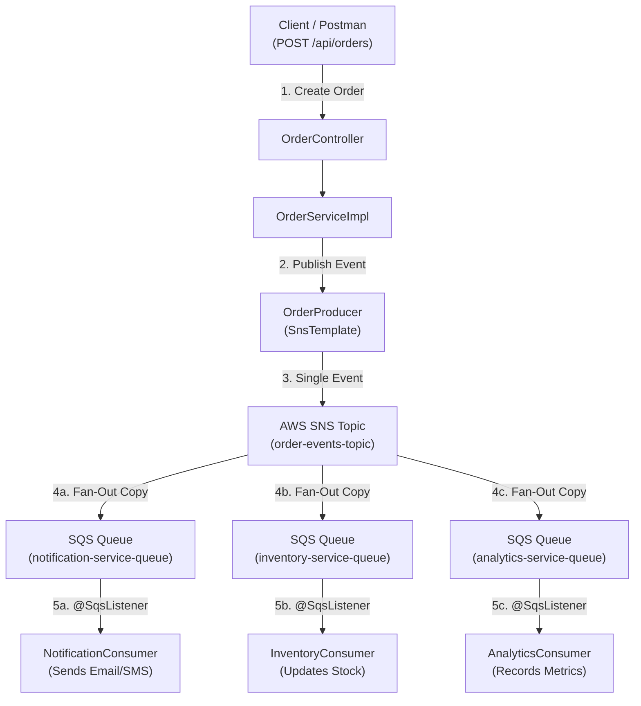

# Order Notification Service - Fan-Out Architecture

A Spring Boot microservice demonstrating the **Fan-Out Messaging Pattern** using **Amazon SNS (Simple Notification Service)** and **Amazon SQS (Simple Queue Service)** via **Spring Cloud AWS 3.1.1**.

---

## 📐 Architecture & Flow Diagram



---

## 🛠️ Technology Stack

- **Java**: 17+
- **Framework**: Spring Boot `3.3.3`
- **AWS Integration**: Spring Cloud AWS `3.1.1` (`spring-cloud-aws-starter-sns`, `spring-cloud-aws-starter-sqs`)
- **Cloud Infrastructure**: AWS SNS & AWS SQS
- **Build Tool**: Maven

---

## 🚀 AWS Infrastructure Setup (AWS CLI)

Replace `621541294334` and `ap-south-1` with your AWS Account ID and Region.

### 1. Create SNS Topic
```bash
aws sns create-topic --name order-events-topic --region ap-south-1
```

### 2. Create SQS Queues
```bash
aws sqs create-queue --queue-name notification-service-queue --region ap-south-1
aws sqs create-queue --queue-name inventory-service-queue --region ap-south-1
aws sqs create-queue --queue-name analytics-service-queue --region ap-south-1
```

### 3. Subscribe SQS Queues to SNS Topic (with Raw Message Delivery)
Enabling `RawMessageDelivery` strips the SNS notification JSON envelope so SQS consumers deserialize `OrderEvent` directly without `null` fields:

```bash
aws sns subscribe \
  --topic-arn arn:aws:sns:ap-south-1:621541294334:order-events-topic \
  --protocol sqs \
  --notification-endpoint arn:aws:sqs:ap-south-1:621541294334:notification-service-queue \
  --attributes RawMessageDelivery=true \
  --region ap-south-1

aws sns subscribe \
  --topic-arn arn:aws:sns:ap-south-1:621541294334:order-events-topic \
  --protocol sqs \
  --notification-endpoint arn:aws:sqs:ap-south-1:621541294334:inventory-service-queue \
  --attributes RawMessageDelivery=true \
  --region ap-south-1

aws sns subscribe \
  --topic-arn arn:aws:sns:ap-south-1:621541294334:order-events-topic \
  --protocol sqs \
  --notification-endpoint arn:aws:sqs:ap-south-1:621541294334:analytics-service-queue \
  --attributes RawMessageDelivery=true \
  --region ap-south-1
```

### 4. Attach SQS Access Policy (Required for Real AWS)
On real AWS, SNS requires queue permissions to push messages to SQS. Run this script to apply the access policy:

```bash
python3 -c "
import json, subprocess

policy_str = json.dumps({
    'Version': '2012-10-17',
    'Statement': [{
        'Effect': 'Allow',
        'Principal': {'Service': 'sns.amazonaws.com'},
        'Action': 'sqs:SendMessage',
        'Resource': 'arn:aws:sqs:ap-south-1:621541294334:*',
        'Condition': {'ArnEquals': {'aws:SourceArn': 'arn:aws:sns:ap-south-1:621541294334:order-events-topic'}}
    }]
})
attr_json = json.dumps({'Policy': policy_str})

for q in ['notification-service-queue', 'inventory-service-queue', 'analytics-service-queue']:
    url = f'https://sqs.ap-south-1.amazonaws.com/621541294334/{q}'
    subprocess.run(['aws', 'sqs', 'set-queue-attributes', '--queue-url', url, '--attributes', attr_json, '--region', 'ap-south-1'])
"
```

---

## 🧪 Testing the Fan-Out Flow

### 1. Start Spring Boot Application
```bash
./mvnw spring-boot:run
```

### 2. Send Order Request via Postman / Curl
- **Method**: `POST`
- **URL**: `http://localhost:8081/api/orders`
- **Headers**: `Content-Type: application/json`

**Sample Body**:
```json
{
  "orderId": "ORD-998822",
  "productId": "PROD-LAPTOP-01",
  "quantity": 2,
  "price": 1299.99,
  "customerEmail": "shubhrajit@example.com"
}
```

**Expected Response (`201 Created`)**:
```json
{
  "orderId": "ORD-998822",
  "status": "SUCCESS",
  "message": "Order created and event published to SNS successfully",
  "timestamp": "2026-09-13T23:45:00.123456"
}
```

### 3. Verify Consumer Logs in Terminal
You will observe all 3 consumer services processing the same event concurrently:
```text
[Notification Service] Received order event from SQS queue for orderId: ORD-998822
[Notification Service] Sending order confirmation email to: shubhrajit@example.com
[Inventory Service] Received order event from SQS queue for orderId: ORD-998822
[Inventory Service] Updating stock for productId: PROD-LAPTOP-01 by quantity: -2
[Analytics Service] Received order event from SQS queue for orderId: ORD-998822
[Analytics Service] Recording metrics: totalAmount=$2599.98 for productId: PROD-LAPTOP-01
```

---

## 🔍 Verification Commands

To check queue message counts and verify all messages were received and auto-deleted upon consumption:

```bash
for q in notification-service-queue inventory-service-queue analytics-service-queue; do
  echo "=== $q ==="
  aws sqs get-queue-attributes \
    --queue-url "https://sqs.ap-south-1.amazonaws.com/621541294334/$q" \
    --attribute-names ApproximateNumberOfMessages ApproximateNumberOfMessagesNotVisible \
    --region ap-south-1
done
```

---

## 🧹 AWS Resource Cleanup Commands

When done testing, execute these commands to purge messages, delete SQS queues, and delete the SNS topic so no unwanted AWS resources remain running:

### 1. Delete SQS Queues
```bash
aws sqs delete-queue --queue-url https://sqs.ap-south-1.amazonaws.com/621541294334/notification-service-queue --region ap-south-1
aws sqs delete-queue --queue-url https://sqs.ap-south-1.amazonaws.com/621541294334/inventory-service-queue --region ap-south-1
aws sqs delete-queue --queue-url https://sqs.ap-south-1.amazonaws.com/621541294334/analytics-service-queue --region ap-south-1
```

### 2. Delete SNS Topic (Auto-deletes subscriptions)
```bash
aws sns delete-topic --topic-arn arn:aws:sns:ap-south-1:621541294334:order-events-topic --region ap-south-1
```
